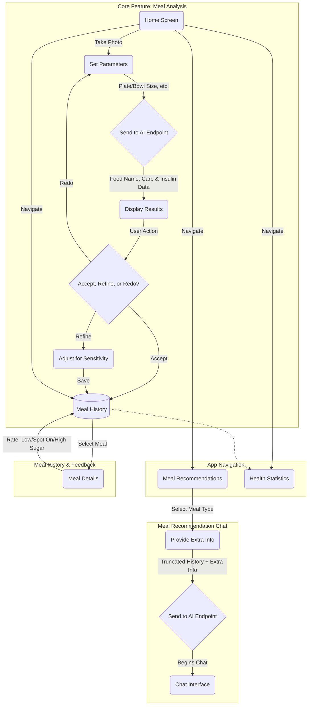

# Carb Counter App: Specification
## 1. Core User Stories
- **As a diabetic user,** I want to photograph my meal, provide size parameters (e.g., plate or bowl diameter), and send this to an AI endpoint. The app should then display the identified food, its estimated carbohydrate count, and a recommended insulin dosage. From there, I want to be able to accept the result, refine the dosage based on my personal insulin sensitivity, or redo the analysis entirely. Accepted or refined results are saved to my meal history.

## 2. Secondary User Stories
- **As a user,** I want to get meal recommendations by selecting a meal type (e.g., breakfast, lunch), providing optional text instructions, and then starting an AI chat. The AI will use my truncated meal history and any provided information to suggest meals.

- **As a user,** I want a meal history page that lists all my past analyzed meals—much like a list of songs in iTunes. For each meal, I want to be able to rate the recommendation's accuracy on a scale from "low sugar" to "spot on" to "high sugar" for my personal reference.

- **As a user,** I want a statistics page that processes my meal history to generate visualizations (e.g., a food group bar chart), helping me monitor my dietary balance and other metrics relevant to managing type 1 diabetes.


## 3. User Flow
This diagram shows the primary navigation path for the user.



## 4. AI Data Contract

When a meal photo is sent to the AI endpoint for analysis, the service must return a JSON object that conforms to the structure of an item in our food database. This ensures consistency across the application.

### Example AI Response Structure
```json
{
    "name": {
        "es": "Arroz “a la cubana”",
        "en": "Arroz “A La Cubana”"
    },
    "category": {
        "es": "Farináceos",
        "en": "Starchy Foods"
    },
    "portion": [
        {
            "weight": 400.0,
            "carbs": 70.0,
            "rations": 7.0
        }
    ]
}
```
*   The AI should return the single most likely portion size it detects. The user can then refine this if necessary.
